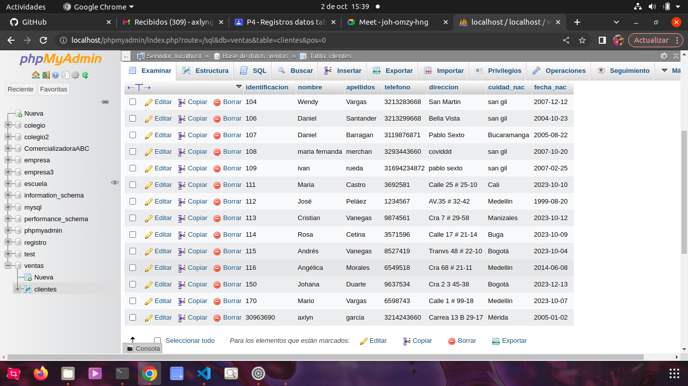
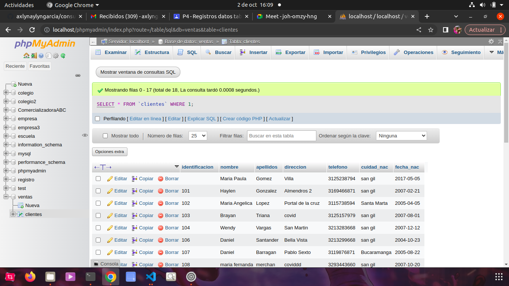
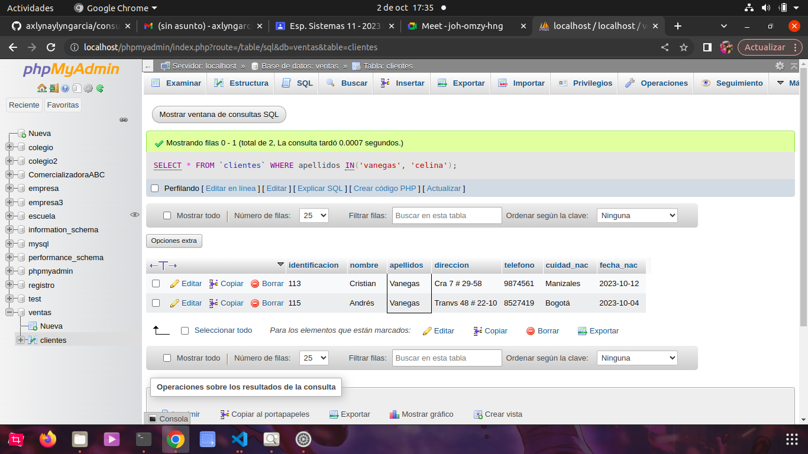
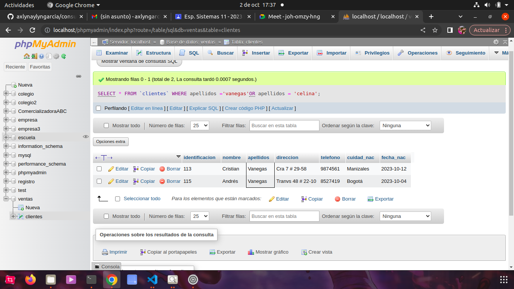

# consulta_1_SQL
# Introduccion a las consultas de una BD usand el lenguaje SQL

## Base de datos. Ventas
## Tbala: Clientes

## Introduccion SELECT

- Permite seleccionar datos de una tabla.
- Su formato es: `SELECT campos_tabla FROM nombre tabla`

### Consulta No. 1
1. Para visualizar toda la información que contiene la tabla Cliente se puede 
incluir con la instrucción SELECT el carácter ***\*** o cada uno de los campos de la tabla

- `SELECT * FROM Cliente 
- `SELECT identificación, nombre, apellidos, dirección, telefono, cuidad_nac, fecha_nac FROM Cliente`

### Consulta No. 2

2. Para visualizar solamente la identificacion del cliente: - `SELECT identificacion. FROM Cliente`

### Consulta No. 3

3. si desea obtener los registros cuya identificacion sea mayor o igual a 150, se debe utilizar la clausula `WHERE` que especifi las condiciones que deben reunir los registros que se van a seleccionar: `SELECT * FROM Cliente WHERE identificacion>=150'

### Consulta No.4
 
4. se desea obtener los registros cuyos apellidos sean Vanegas o Celina, se debe utilizar el operador `IN` Que especifica los registros de una tabla. 

`SELECT apellidos FROM cliente WHERE apellidos IN('vanegas', 'celina')`

O se puede utilizar el operador `OR`

`SELECT apellidos FROM cliente WHERE apellidos ='vanegas'OR apellidos = 'celina'`

